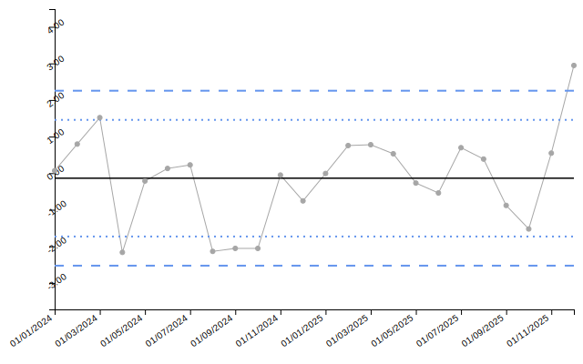
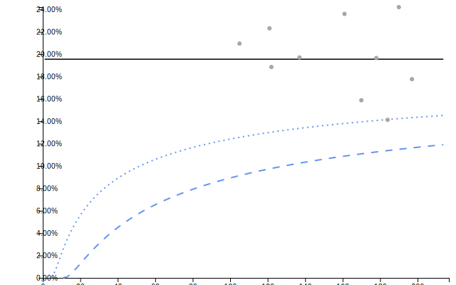

<!-- README.md is generated from README.Rmd. Please edit that file -->

# controlcharts

<!-- badges: start -->

[](https://github.com/AUS-DOH-Safety-and-Quality/controlcharts/actions/workflows/R-CMD-check.yaml)
[](https://CRAN.R-project.org/package=controlcharts)
[](https://AUS-DOH-Safety-and-Quality.r-universe.dev/controlcharts)
<!-- badges: end -->

## Installation

You can install the development version of controlcharts from
[GitHub](https://github.com/) with:

``` r
# install.packages("remotes")
remotes::install_github("AUS-DOH-Safety-and-Quality/controlcharts")
```

Or you can install pre-built binaries from R-Universe:

``` r
install.packages("controlcharts", repos = c("https://AUS-DOH-Safety-and-Quality.r-universe.dev",
                                            "https://cran.r-project.org"))
```

## Getting Started

### SPC

``` r
# Simulate 2 years of monthly data
dat <- data.frame(
  month = seq(as.Date('2024-01-01'), length.out = 24, by = "month"),
  y = rnorm(24)
)


spc_chart <- controlcharts::spc(data = dat, numerators = y, keys = month)
```

``` r
spc_chart$static_plot
```



### Funnel Plot

``` r
# Simulate proportion data for 10 organisations
denoms <- sample(100:200, 10)
funnel_data <- data.frame(
  organisation = letters[1:10],
  numerators = rbinom(10, size = denoms, prob = 0.2),
  denominators = denoms
)

funnel_chart <- controlcharts::funnel(data = funnel_data,
                                       numerators = numerators,
                                       denominators = denominators,
                                       keys = organisation)
```

``` r
funnel_chart$static_plot
```


