# Outlier Detection and NHS Icons

## Introduction

Statistical Process Control (SPC) charts are powerful tools for
detecting signals of change in processes over time. The `controlcharts`
package provides comprehensive outlier detection capabilities to help
identify when a process has shifted from its baseline state.

This vignette demonstrates:

- **Four outlier detection methods**: astronomical points, shifts,
  trends, and 2-in-3 patterns
- **Custom detection parameters**: adjusting sensitivity for shift and
  trend lengths
- **Directional flagging**: specifying what constitutes improvement vs
  deterioration
- **NHS icons**: variation and assurance icons for visual interpretation
- **Combined approaches**: using multiple detection methods
  simultaneously

All outlier detection settings are configured through the
`outlier_settings` parameter, while NHS icons are configured through the
`nhs_icon_settings` parameter.

## Outlier Detection Methods

### Astronomical Points

Astronomical points (also called astronomical signals or special cause
variation) are individual data points that fall outside the statistical
control limits. By default, these are points beyond the 3-sigma limits.

``` r
# Create data with some extreme outliers
dat_astro <- data.frame(
  month = seq(as.Date("2024-01-01"), length.out = 24, by = "month"),
  infections = c(rnorm(10, mean = 15, sd = 3),
                 28,  # Astronomical point
                 rnorm(5, mean = 15, sd = 3),
                 6,   # Astronomical point
                 rnorm(7, mean = 15, sd = 3))
)
```

``` r
chart_astro <- spc(data = dat_astro,
                   keys = month,
                   numerators = infections,
                   spc_settings = list(chart_type = "i"),
                   outlier_settings = list(
                     astronomical = TRUE,
                     astronomical_limit = "3 Sigma"
                   ))

chart_astro$static_plot
```

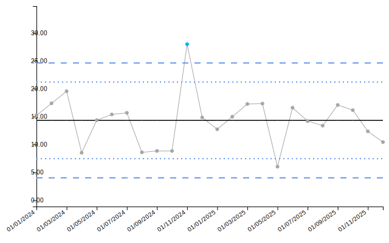

``` r
knitr::kable(chart_astro$limits[9:14, ], digits = 2)
```

|     | date       | value | target | ll99 | ll95 |  ll68 |  ul68 |  ul95 |  ul99 | trend_line | astpoint    |
|:----|:-----------|------:|-------:|-----:|-----:|------:|------:|------:|------:|-----------:|:------------|
| 9   | 01/09/2024 |  8.83 |  14.32 | 4.01 | 7.44 | 10.88 | 17.76 | 21.19 | 24.63 |      14.50 | none        |
| 10  | 01/10/2024 |  8.83 |  14.32 | 4.01 | 7.44 | 10.88 | 17.76 | 21.19 | 24.63 |      14.45 | none        |
| 11  | 01/11/2024 | 28.00 |  14.32 | 4.01 | 7.44 | 10.88 | 17.76 | 21.19 | 24.63 |      14.39 | improvement |
| 12  | 01/12/2024 | 14.84 |  14.32 | 4.01 | 7.44 | 10.88 | 17.76 | 21.19 | 24.63 |      14.34 | none        |
| 13  | 01/01/2025 | 12.73 |  14.32 | 4.01 | 7.44 | 10.88 | 17.76 | 21.19 | 24.63 |      14.29 | none        |
| 14  | 01/02/2025 | 14.97 |  14.32 | 4.01 | 7.44 | 10.88 | 17.76 | 21.19 | 24.63 |      14.24 | none        |

Astronomical points indicate special cause variation - something unusual
has occurred that requires investigation. You can adjust the which limit
is used for flagging by changing the `astronomical_limit` parameter to
“2 Sigma” or “1 Sigma”:

``` r
chart_astro_2s <- spc(data = dat_astro,
                      keys = month,
                      numerators = infections,
                      spc_settings = list(chart_type = "i"),
                      outlier_settings = list(
                        astronomical = TRUE,
                        astronomical_limit = "2 Sigma"
                      ))

chart_astro_2s$static_plot
```

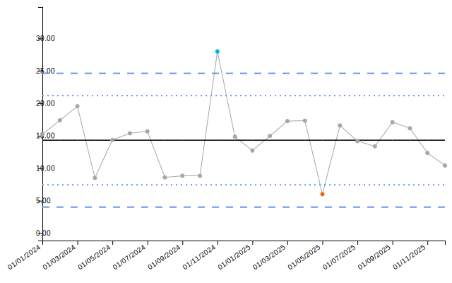

### Shift Detection

A shift occurs when multiple consecutive points fall on the same side of
the centerline, suggesting a sustained change in the process mean. The
default threshold is 7 consecutive points. This example shows a 6-point
shift, which will not be flagged with the default setting:

``` r
# Create data with a 6-point shift at the end
dat_shift <- data.frame(
  month = seq(as.Date("2024-01-01"), length.out = 24, by = "month"),
  satisfaction = c(rnorm(18, mean = 75, sd = 5),  # Baseline
                   rnorm(6, mean = 82, sd = 5))   # 6-point shift at end
)
```

``` r
chart_shift <- spc(data = dat_shift,
                   keys = month,
                   numerators = satisfaction,
                   spc_settings = list(chart_type = "i"),
                   outlier_settings = list(
                     shift = TRUE
                   ))

chart_shift$static_plot
```

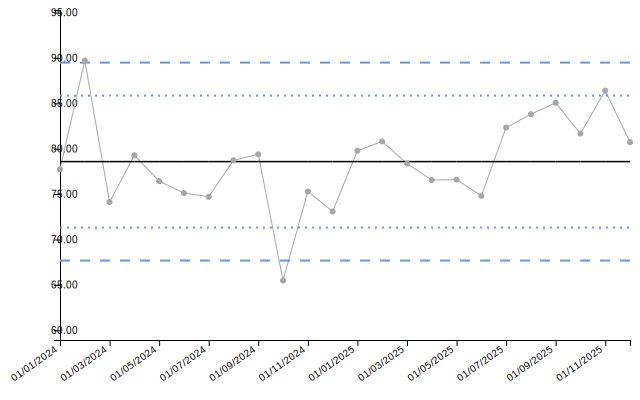

``` r
knitr::kable(tail(chart_shift$limits, 10), digits = 2)
```

|     | date       | value | target |  ll99 |  ll95 |  ll68 |  ul68 |  ul95 |  ul99 | trend_line | shift |
|:----|:-----------|------:|-------:|------:|------:|------:|------:|------:|------:|-----------:|:------|
| 15  | 01/03/2025 | 78.37 |  78.58 | 67.68 | 71.31 | 74.95 | 82.22 | 85.85 | 89.49 |      79.12 | none  |
| 16  | 01/04/2025 | 76.55 |  78.58 | 67.68 | 71.31 | 74.95 | 82.22 | 85.85 | 89.49 |      79.34 | none  |
| 17  | 01/05/2025 | 76.60 |  78.58 | 67.68 | 71.31 | 74.95 | 82.22 | 85.85 | 89.49 |      79.55 | none  |
| 18  | 01/06/2025 | 74.81 |  78.58 | 67.68 | 71.31 | 74.95 | 82.22 | 85.85 | 89.49 |      79.77 | none  |
| 19  | 01/07/2025 | 82.33 |  78.58 | 67.68 | 71.31 | 74.95 | 82.22 | 85.85 | 89.49 |      79.98 | none  |
| 20  | 01/08/2025 | 83.81 |  78.58 | 67.68 | 71.31 | 74.95 | 82.22 | 85.85 | 89.49 |      80.20 | none  |
| 21  | 01/09/2025 | 85.06 |  78.58 | 67.68 | 71.31 | 74.95 | 82.22 | 85.85 | 89.49 |      80.41 | none  |
| 22  | 01/10/2025 | 81.67 |  78.58 | 67.68 | 71.31 | 74.95 | 82.22 | 85.85 | 89.49 |      80.63 | none  |
| 23  | 01/11/2025 | 86.41 |  78.58 | 67.68 | 71.31 | 74.95 | 82.22 | 85.85 | 89.49 |      80.84 | none  |
| 24  | 01/12/2025 | 80.72 |  78.58 | 67.68 | 71.31 | 74.95 | 82.22 | 85.85 | 89.49 |      81.06 | none  |

You can customize the shift detection by changing `shift_n`. Setting it
to 5 or 6 will now detect the 6-point shift:

``` r
chart_shift_6 <- spc(data = dat_shift,
                     keys = month,
                     numerators = satisfaction,
                     spc_settings = list(chart_type = "i"),
                     outlier_settings = list(
                       shift = TRUE,
                       shift_n = 6
                     ))

chart_shift_6$static_plot
```

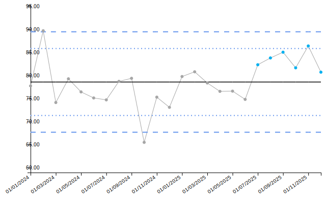

### Trend Detection

Trends detect monotonic increases or decreases over consecutive points,
indicating a sustained directional change. The default is 5 consecutive
points showing consistent direction. This example shows a 4-point trend,
which will not be flagged with the default setting:

``` r
# Create data with a 4-point upward trend at the end
dat_trend <- data.frame(
  month = seq(as.Date("2024-01-01"), length.out = 24, by = "month"),
  wait_time = c(rnorm(20, mean = 30, sd = 3),
                31, 33, 35, 37)  # 4-point increasing trend at end
)
```

``` r
chart_trend <- spc(data = dat_trend,
                   keys = month,
                   numerators = wait_time,
                   spc_settings = list(chart_type = "i"),
                   outlier_settings = list(
                     trend = TRUE
                   ))

chart_trend$static_plot
```

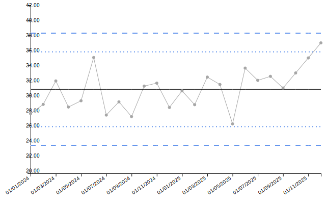

``` r
knitr::kable(tail(chart_trend$limits, 10), digits = 2)
```

|     | date       | value | target |  ll99 |  ll95 |  ll68 |  ul68 |  ul95 | ul99 | trend_line | trend |
|:----|:-----------|------:|-------:|------:|------:|------:|------:|------:|-----:|-----------:|:------|
| 15  | 01/03/2025 | 32.45 |  30.84 | 23.38 | 25.86 | 28.35 | 33.32 | 35.81 | 38.3 |      31.37 | none  |
| 16  | 01/04/2025 | 31.47 |  30.84 | 23.38 | 25.86 | 28.35 | 33.32 | 35.81 | 38.3 |      31.58 | none  |
| 17  | 01/05/2025 | 26.24 |  30.84 | 23.38 | 25.86 | 28.35 | 33.32 | 35.81 | 38.3 |      31.79 | none  |
| 18  | 01/06/2025 | 33.65 |  30.84 | 23.38 | 25.86 | 28.35 | 33.32 | 35.81 | 38.3 |      32.01 | none  |
| 19  | 01/07/2025 | 32.02 |  30.84 | 23.38 | 25.86 | 28.35 | 33.32 | 35.81 | 38.3 |      32.22 | none  |
| 20  | 01/08/2025 | 32.55 |  30.84 | 23.38 | 25.86 | 28.35 | 33.32 | 35.81 | 38.3 |      32.43 | none  |
| 21  | 01/09/2025 | 31.00 |  30.84 | 23.38 | 25.86 | 28.35 | 33.32 | 35.81 | 38.3 |      32.65 | none  |
| 22  | 01/10/2025 | 33.00 |  30.84 | 23.38 | 25.86 | 28.35 | 33.32 | 35.81 | 38.3 |      32.86 | none  |
| 23  | 01/11/2025 | 35.00 |  30.84 | 23.38 | 25.86 | 28.35 | 33.32 | 35.81 | 38.3 |      33.07 | none  |
| 24  | 01/12/2025 | 37.00 |  30.84 | 23.38 | 25.86 | 28.35 | 33.32 | 35.81 | 38.3 |      33.29 | none  |

Setting `trend_n` to 4 or fewer will now detect the 4-point trend:

``` r
chart_trend_4 <- spc(data = dat_trend,
                     keys = month,
                     numerators = wait_time,
                     spc_settings = list(chart_type = "i"),
                     outlier_settings = list(
                       trend = TRUE,
                       trend_n = 4
                     ))

chart_trend_4$static_plot
```

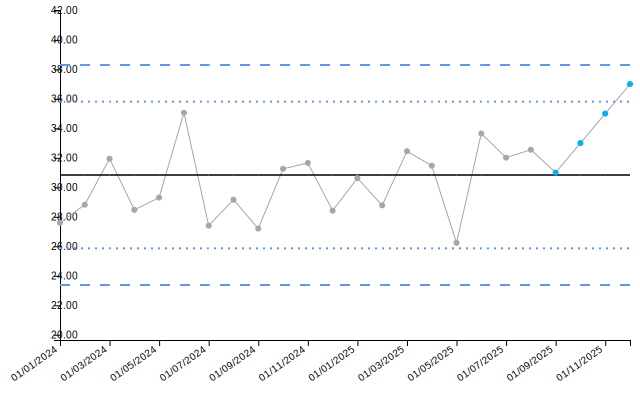

### Two-in-Three Detection

The 2-in-3 rule detects when 2 out of any 3 consecutive points fall
outside the 2-sigma (95%) warning limits. This pattern suggests early
signs of process change.

``` r
# Create data with 2-in-3 pattern
# With mean=120 and sd=5, 2-sigma limits are approximately 120 ± 10
# So values above 130 or below 110 should exceed 2-sigma
dat_2in3 <- data.frame(
  month = seq(as.Date("2024-01-01"), length.out = 24, by = "month"),
  pressure = c(rnorm(8, mean = 120, sd = 5),
               131, 133, 121,  # 2 out of 3 outside 2-sigma (131 and 133 > 130)
               rnorm(13, mean = 120, sd = 5))
)
```

``` r
chart_2in3 <- spc(data = dat_2in3,
                  keys = month,
                  numerators = pressure,
                  spc_settings = list(chart_type = "i"),
                  outlier_settings = list(
                    two_in_three = TRUE,
                    two_in_three_limit = "2 Sigma"
                  ))

chart_2in3$static_plot
```

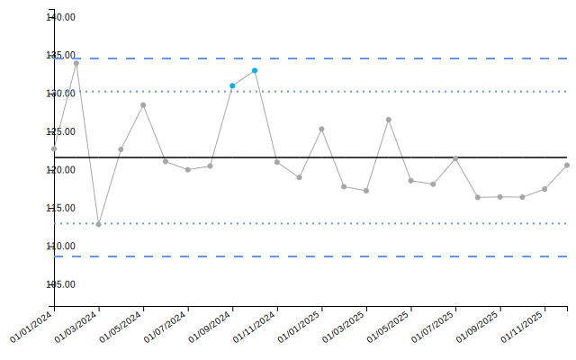

``` r
knitr::kable(head(chart_2in3$limits, 12), digits = 2)
```

| date       |  value | target |   ll99 |   ll95 |  ll68 |   ul68 |   ul95 |   ul99 | trend_line | two_in_three |
|:-----------|-------:|-------:|-------:|-------:|------:|-------:|-------:|-------:|-----------:|:-------------|
| 01/01/2024 | 122.73 | 121.62 | 108.66 | 112.98 | 117.3 | 125.94 | 130.26 | 134.58 |     125.42 | none         |
| 01/02/2024 | 133.96 | 121.62 | 108.66 | 112.98 | 117.3 | 125.94 | 130.26 | 134.58 |     125.09 | none         |
| 01/03/2024 | 112.85 | 121.62 | 108.66 | 112.98 | 117.3 | 125.94 | 130.26 | 134.58 |     124.76 | none         |
| 01/04/2024 | 122.67 | 121.62 | 108.66 | 112.98 | 117.3 | 125.94 | 130.26 | 134.58 |     124.43 | none         |
| 01/05/2024 | 128.49 | 121.62 | 108.66 | 112.98 | 117.3 | 125.94 | 130.26 | 134.58 |     124.09 | none         |
| 01/06/2024 | 121.09 | 121.62 | 108.66 | 112.98 | 117.3 | 125.94 | 130.26 | 134.58 |     123.76 | none         |
| 01/07/2024 | 120.01 | 121.62 | 108.66 | 112.98 | 117.3 | 125.94 | 130.26 | 134.58 |     123.43 | none         |
| 01/08/2024 | 120.50 | 121.62 | 108.66 | 112.98 | 117.3 | 125.94 | 130.26 | 134.58 |     123.10 | none         |
| 01/09/2024 | 131.00 | 121.62 | 108.66 | 112.98 | 117.3 | 125.94 | 130.26 | 134.58 |     122.77 | improvement  |
| 01/10/2024 | 133.00 | 121.62 | 108.66 | 112.98 | 117.3 | 125.94 | 130.26 | 134.58 |     122.44 | improvement  |
| 01/11/2024 | 121.00 | 121.62 | 108.66 | 112.98 | 117.3 | 125.94 | 130.26 | 134.58 |     122.11 | none         |
| 01/12/2024 | 118.99 | 121.62 | 108.66 | 112.98 | 117.3 | 125.94 | 130.26 | 134.58 |     121.78 | none         |

By default, only the points outside the limits are highlighted. You can
highlight all points in the pattern by setting
`two_in_three_highlight_series = TRUE`:

``` r
chart_2in3_all <- spc(data = dat_2in3,
                      keys = month,
                      numerators = pressure,
                      spc_settings = list(chart_type = "i"),
                      outlier_settings = list(
                        two_in_three = TRUE,
                        two_in_three_limit = "2 Sigma",
                        two_in_three_highlight_series = TRUE
                      ))

chart_2in3_all$static_plot
```

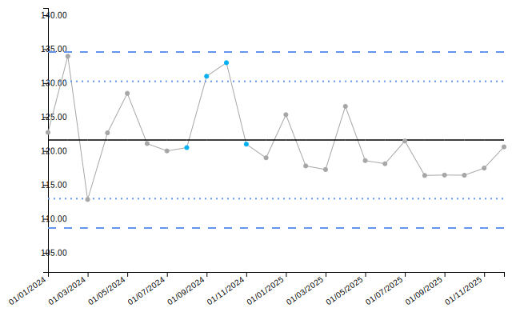

## Improvement Direction and Flag Types

### Improvement Direction

The `improvement_direction` setting specifies what constitutes an
improvement in your process. This is crucial for correctly classifying
outliers.

``` r
# For metrics where lower is better (e.g., infection rates)
dat_infections <- data.frame(
  month = seq(as.Date("2024-01-01"), length.out = 24, by = "month"),
  infections = c(rnorm(16, mean = 10, sd = 1),
                 rnorm(8, mean = 5, sd = 1))  # Improvement (decrease shift)
)

chart_inf <- spc(data = dat_infections,
                 keys = month,
                 numerators = infections,
                 spc_settings = list(chart_type = "i"),
                 outlier_settings = list(
                   shift = TRUE,
                   improvement_direction = "decrease"
                 ))

chart_inf$static_plot
```

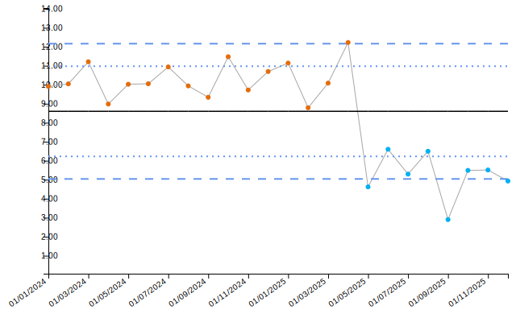

``` r
# For metrics where higher is better (e.g., hand hygiene compliance)
dat_compliance <- data.frame(
  month = seq(as.Date("2024-01-01"), length.out = 24, by = "month"),
  compliance = c(rnorm(12, mean = 75, sd = 5),
                 rnorm(12, mean = 85, sd = 5))  # Improvement (increase)
)

chart_comp <- spc(data = dat_compliance,
                  keys = month,
                  numerators = compliance,
                  spc_settings = list(chart_type = "i"),
                  outlier_settings = list(
                    shift = TRUE,
                    improvement_direction = "increase"
                  ))

chart_comp$static_plot
```

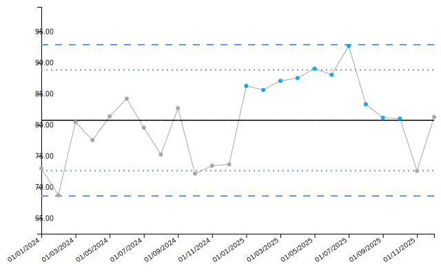

Setting `improvement_direction = "neutral"` treats all outliers equally,
with no distinction between improvement and deterioration.

### Process Flag Type

The `process_flag_type` setting allows you to filter which outliers are
flagged. This is useful when you only want to be alerted to
deteriorations (not improvements) or vice versa.

First, let’s create data with both an improvement (decrease) and a
deterioration (increase) in infection rates:

``` r
# Data with both improvement and deterioration
dat_flag_type <- data.frame(
  month = seq(as.Date("2024-01-01"), length.out = 24, by = "month"),
  infections = c(rnorm(5, mean = 8, sd = 1.5),
                 rnorm(8, mean = 5, sd = 1.5),   # Improvement (decrease)
                 rnorm(11, mean = 10, sd = 1.5))  # Deterioration (increase)
)
```

With the default setting (`process_flag_type = "both"`), both the
improvement and deterioration shifts are flagged:

``` r
chart_both <- spc(data = dat_flag_type,
                  keys = month,
                  numerators = infections,
                  spc_settings = list(chart_type = "i"),
                  outlier_settings = list(
                    shift = TRUE,
                    improvement_direction = "decrease",
                    process_flag_type = "both"
                  ))

chart_both$static_plot
```

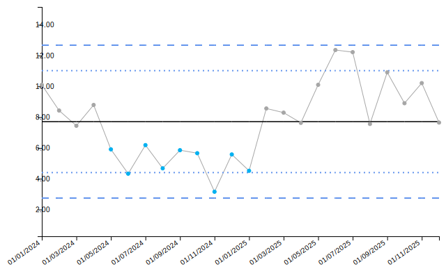

Now, setting `process_flag_type = "deterioration"` will only flag the
increase (deterioration), ignoring the improvement:

``` r
chart_det_only <- spc(data = dat_flag_type,
                      keys = month,
                      numerators = infections,
                      spc_settings = list(chart_type = "i"),
                      outlier_settings = list(
                        shift = TRUE,
                        improvement_direction = "decrease",
                        process_flag_type = "deterioration"
                      ))

chart_det_only$static_plot
```

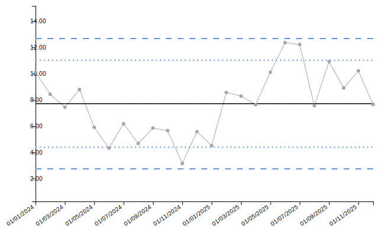

This setting is particularly useful for safety metrics where you want to
be immediately alerted to increases (deteriorations) but don’t need
visual flags for improvements.

## NHS Icons

NHS icons provide standardized visual indicators of process variation
and assurance status, following NHS England’s guidance for SPC in
healthcare.

### Variation Icons

Variation icons indicate the type of variation present in the chart. By
default, icons are only shown if a pattern is detected at the last
point:

``` r
# Data with shift ending at the last point
dat_var_last <- data.frame(
  month = seq(as.Date("2024-01-01"), length.out = 24, by = "month"),
  readmissions = c(rnorm(10, mean = 12, sd = 2),
                   rnorm(14, mean = 16, sd = 2))  # Shift at end
)

chart_var_last <- spc(data = dat_var_last,
                      keys = month,
                      numerators = readmissions,
                      spc_settings = list(chart_type = "i"),
                      outlier_settings = list(
                        astronomical = TRUE,
                        shift = TRUE,
                        improvement_direction = "decrease"
                      ),
                      nhs_icon_settings = list(
                        show_variation_icons = TRUE,
                        flag_last_point = TRUE,
                        variation_icons_locations = "Top Right"
                      ))

chart_var_last$static_plot
```

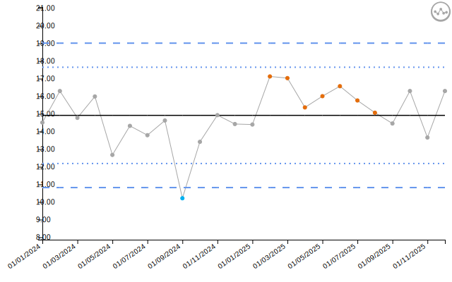

If the pattern occurs earlier in the data but not at the last point, the
icon will not be shown with default settings:

``` r
# Data with shift in the middle, not at the end
dat_var_middle <- data.frame(
  month = seq(as.Date("2024-01-01"), length.out = 24, by = "month"),
  readmissions = c(rnorm(8, mean = 12, sd = 2),
                   rnorm(8, mean = 16, sd = 2),  # Shift in middle
                   rnorm(8, mean = 12, sd = 2))  # Back to baseline
)

chart_var_middle <- spc(data = dat_var_middle,
                        keys = month,
                        numerators = readmissions,
                        spc_settings = list(chart_type = "i"),
                        outlier_settings = list(
                          astronomical = TRUE,
                          shift = TRUE,
                          improvement_direction = "decrease"
                        ),
                        nhs_icon_settings = list(
                          show_variation_icons = TRUE,
                          flag_last_point = TRUE,
                          variation_icons_locations = "Top Right"
                        ))

chart_var_middle$static_plot
```

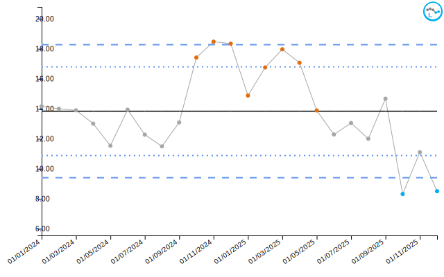

Setting `flag_last_point = FALSE` will show icons for all relevant
points, not just the last observation:

``` r
chart_var_all <- spc(data = dat_var_middle,
                     keys = month,
                     numerators = readmissions,
                     spc_settings = list(chart_type = "i"),
                     outlier_settings = list(
                       astronomical = TRUE,
                       shift = TRUE,
                       improvement_direction = "decrease"
                     ),
                     nhs_icon_settings = list(
                       show_variation_icons = TRUE,
                       flag_last_point = FALSE,
                       variation_icons_locations = "Top Right"
                     ))

chart_var_all$static_plot
```

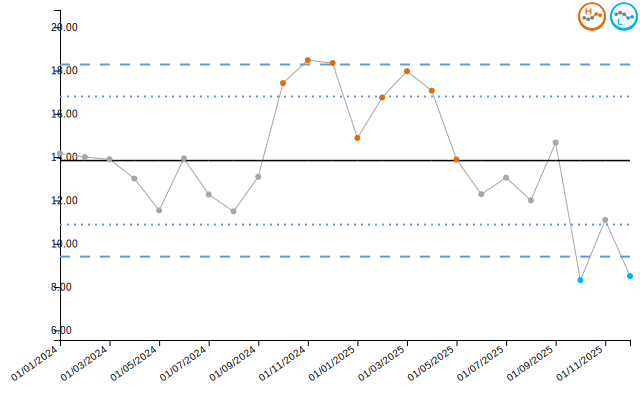

You can also customize the icon placement and scaling:

``` r
chart_var_bl <- spc(data = dat_var_last,
                    keys = month,
                    numerators = readmissions,
                    spc_settings = list(chart_type = "i"),
                    outlier_settings = list(
                      astronomical = TRUE,
                      shift = TRUE,
                      improvement_direction = "decrease"
                    ),
                    nhs_icon_settings = list(
                      show_variation_icons = TRUE,
                      variation_icons_locations = "Bottom Left",
                      variation_icons_scaling = 1.2
                    ))

chart_var_bl$static_plot
```

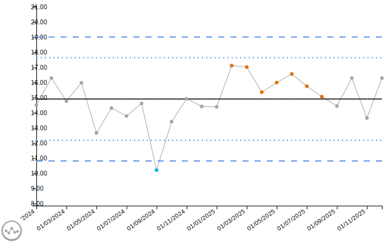

### Assurance Icons

Assurance icons indicate whether the process is consistently meeting a
target threshold. **Important**: Assurance icons require an `alt_target`
value to be specified in `line_settings`.

The assurance status depends on the position of the `alt_target`
relative to the 99% control limits:

- **Consistent Pass**: Target is below the lower 99% limit (process
  consistently exceeds target)
- **Consistent Fail**: Target is above the upper 99% limit (process
  consistently below target)
- **Variable**: Target is within the 99% limits (process sometimes
  meets, sometimes doesn’t)

#### Example: Consistent Pass

When the `alt_target` is below the lower 99% control limit, the process
consistently exceeds the target:

``` r
# Process centered around 95%, target at 90% will be below lower 99% limit
dat_assurance_pass <- data.frame(
  month = seq(as.Date("2024-01-01"), length.out = 24, by = "month"),
  vaccination_rate = rnorm(24, mean = 95, sd = 1)
)

chart_assurance_pass <- spc(data = dat_assurance_pass,
                            keys = month,
                            numerators = vaccination_rate,
                            spc_settings = list(chart_type = "i"),
                            nhs_icon_settings = list(
                              show_assurance_icons = TRUE,
                              assurance_icons_locations = "Top Right"
                            ),
                            line_settings = list(
                              show_alt_target = TRUE,
                              alt_target = 90,
                              colour_alt_target = "#E69F00"
                            ))

chart_assurance_pass$static_plot
```

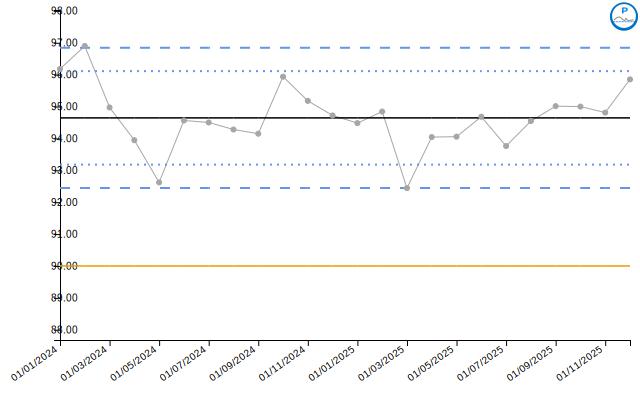

``` r
knitr::kable(tail(chart_assurance_pass$limits, 6), digits = 2)
```

|     | date       | value | target | alt_target |  ll99 |  ll95 |  ll68 |  ul68 |  ul95 |  ul99 | trend_line |
|:----|:-----------|------:|-------:|-----------:|------:|------:|------:|------:|------:|------:|-----------:|
| 19  | 01/07/2025 | 93.76 |  94.64 |         90 | 92.45 | 93.18 | 93.91 | 95.38 | 96.11 | 96.84 |      94.55 |
| 20  | 01/08/2025 | 94.54 |  94.64 |         90 | 92.45 | 93.18 | 93.91 | 95.38 | 96.11 | 96.84 |      94.53 |
| 21  | 01/09/2025 | 95.01 |  94.64 |         90 | 92.45 | 93.18 | 93.91 | 95.38 | 96.11 | 96.84 |      94.52 |
| 22  | 01/10/2025 | 95.00 |  94.64 |         90 | 92.45 | 93.18 | 93.91 | 95.38 | 96.11 | 96.84 |      94.50 |
| 23  | 01/11/2025 | 94.81 |  94.64 |         90 | 92.45 | 93.18 | 93.91 | 95.38 | 96.11 | 96.84 |      94.49 |
| 24  | 01/12/2025 | 95.85 |  94.64 |         90 | 92.45 | 93.18 | 93.91 | 95.38 | 96.11 | 96.84 |      94.48 |

#### Example: Consistent Fail

When the `alt_target` is above the upper 99% control limit, the process
consistently fails to meet the target:

``` r
# Process centered around 82%, target at 90% will be above upper 99% limit
dat_assurance_fail <- data.frame(
  month = seq(as.Date("2024-01-01"), length.out = 24, by = "month"),
  vaccination_rate = rnorm(24, mean = 82, sd = 1.5)
)

chart_assurance_fail <- spc(data = dat_assurance_fail,
                            keys = month,
                            numerators = vaccination_rate,
                            spc_settings = list(chart_type = "i"),
                            nhs_icon_settings = list(
                              show_assurance_icons = TRUE,
                              assurance_icons_locations = "Top Right"
                            ),
                            line_settings = list(
                              show_alt_target = TRUE,
                              alt_target = 90,
                              colour_alt_target = "#E69F00"
                            ))

chart_assurance_fail$static_plot
```

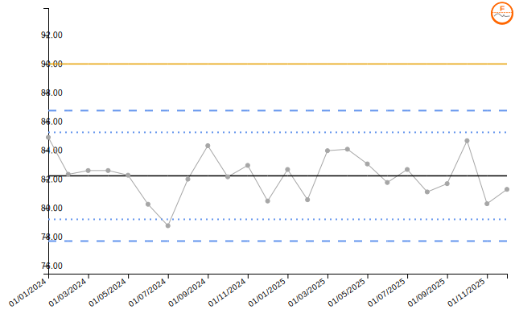

``` r
knitr::kable(tail(chart_assurance_fail$limits, 6), digits = 2)
```

|     | date       | value | target | alt_target |  ll99 |  ll95 |  ll68 |  ul68 |  ul95 |  ul99 | trend_line |
|:----|:-----------|------:|-------:|-----------:|------:|------:|------:|------:|------:|------:|-----------:|
| 19  | 01/07/2025 | 82.68 |  82.24 |         90 | 77.71 | 79.22 | 80.73 | 83.75 | 85.26 | 86.77 |      82.12 |
| 20  | 01/08/2025 | 81.12 |  82.24 |         90 | 77.71 | 79.22 | 80.73 | 83.75 | 85.26 | 86.77 |      82.10 |
| 21  | 01/09/2025 | 81.70 |  82.24 |         90 | 77.71 | 79.22 | 80.73 | 83.75 | 85.26 | 86.77 |      82.08 |
| 22  | 01/10/2025 | 84.68 |  82.24 |         90 | 77.71 | 79.22 | 80.73 | 83.75 | 85.26 | 86.77 |      82.06 |
| 23  | 01/11/2025 | 80.31 |  82.24 |         90 | 77.71 | 79.22 | 80.73 | 83.75 | 85.26 | 86.77 |      82.04 |
| 24  | 01/12/2025 | 81.30 |  82.24 |         90 | 77.71 | 79.22 | 80.73 | 83.75 | 85.26 | 86.77 |      82.02 |

#### Example: Variable Performance

When the `alt_target` falls within the 99% control limits, performance
is variable:

``` r
# Process centered around 90%, target at 90% will be within limits
dat_assurance_variable <- data.frame(
  month = seq(as.Date("2024-01-01"), length.out = 24, by = "month"),
  vaccination_rate = rnorm(24, mean = 90, sd = 2)
)

chart_assurance_variable <- spc(data = dat_assurance_variable,
                                keys = month,
                                numerators = vaccination_rate,
                                spc_settings = list(chart_type = "i"),
                                nhs_icon_settings = list(
                                  show_assurance_icons = TRUE,
                                  assurance_icons_locations = "Top Right"
                                ),
                                line_settings = list(
                                  show_alt_target = TRUE,
                                  alt_target = 90,
                                  colour_alt_target = "#E69F00"
                                ))

chart_assurance_variable$static_plot
```

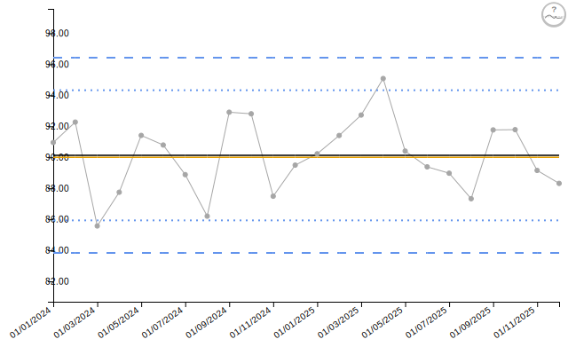

``` r
knitr::kable(tail(chart_assurance_variable$limits, 6), digits = 2)
```

|     | date       | value | target | alt_target |  ll99 |  ll95 |  ll68 |  ul68 |  ul95 |  ul99 | trend_line |
|:----|:-----------|------:|-------:|-----------:|------:|------:|------:|------:|------:|------:|-----------:|
| 19  | 01/07/2025 | 88.97 |  90.13 |         90 | 83.83 | 85.93 | 88.03 | 92.23 | 94.33 | 96.43 |      90.26 |
| 20  | 01/08/2025 | 87.33 |  90.13 |         90 | 83.83 | 85.93 | 88.03 | 92.23 | 94.33 | 96.43 |      90.28 |
| 21  | 01/09/2025 | 91.77 |  90.13 |         90 | 83.83 | 85.93 | 88.03 | 92.23 | 94.33 | 96.43 |      90.30 |
| 22  | 01/10/2025 | 91.78 |  90.13 |         90 | 83.83 | 85.93 | 88.03 | 92.23 | 94.33 | 96.43 |      90.32 |
| 23  | 01/11/2025 | 89.15 |  90.13 |         90 | 83.83 | 85.93 | 88.03 | 92.23 | 94.33 | 96.43 |      90.34 |
| 24  | 01/12/2025 | 88.32 |  90.13 |         90 | 83.83 | 85.93 | 88.03 | 92.23 | 94.33 | 96.43 |      90.36 |

### Combined Variation and Assurance Icons

You can display both icon types simultaneously by placing them in
different corners:

``` r
chart_both_icons <- spc(data = dat_assurance_pass,
                        keys = month,
                        numerators = vaccination_rate,
                        spc_settings = list(chart_type = "i"),
                        outlier_settings = list(
                          astronomical = TRUE,
                          shift = TRUE,
                          trend = TRUE,
                          improvement_direction = "increase"
                        ),
                        nhs_icon_settings = list(
                          show_variation_icons = TRUE,
                          variation_icons_locations = "Top Left",
                          show_assurance_icons = TRUE,
                          assurance_icons_locations = "Top Right"
                        ),
                        line_settings = list(
                          show_alt_target = TRUE,
                          alt_target = 90,
                          colour_alt_target = "#E69F00"
                        ))

chart_both_icons$static_plot
```

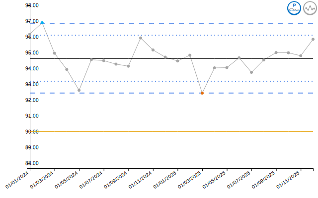

## Settings Reference

### Outlier Detection Settings

| Setting                         | Type      | Default    | Options/Range                                    | Purpose                        |
|---------------------------------|-----------|------------|--------------------------------------------------|--------------------------------|
| `astronomical`                  | boolean   | FALSE      | TRUE/FALSE                                       | Detect points outside limits   |
| `astronomical_limit`            | character | “3 Sigma”  | “1 Sigma”, “2 Sigma”, “3 Sigma”, “Specification” | Which limit to use             |
| `shift`                         | boolean   | FALSE      | TRUE/FALSE                                       | Detect runs on one side        |
| `shift_n`                       | numeric   | 7          | Min: 1                                           | Points needed for shift        |
| `trend`                         | boolean   | FALSE      | TRUE/FALSE                                       | Detect trends                  |
| `trend_n`                       | numeric   | 5          | Min: 1                                           | Points needed for trend        |
| `two_in_three`                  | boolean   | FALSE      | TRUE/FALSE                                       | Detect 2-in-3 pattern          |
| `two_in_three_limit`            | character | “2 Sigma”  | “1 Sigma”, “2 Sigma”, “3 Sigma”, “Specification” | Warning limit                  |
| `two_in_three_highlight_series` | boolean   | FALSE      | TRUE/FALSE                                       | Highlight all vs outliers only |
| `improvement_direction`         | character | “increase” | “increase”, “decrease”, “neutral”                | What constitutes improvement   |
| `process_flag_type`             | character | “both”     | “both”, “improvement”, “deterioration”           | Which outliers to flag         |

### NHS Icon Settings

| Setting                     | Type      | Default     | Options/Range                                          | Purpose                 |
|-----------------------------|-----------|-------------|--------------------------------------------------------|-------------------------|
| `show_variation_icons`      | boolean   | FALSE       | TRUE/FALSE                                             | Display variation icons |
| `flag_last_point`           | boolean   | TRUE        | TRUE/FALSE                                             | Icon on last point only |
| `variation_icons_locations` | character | “Top Right” | “Top Right”, “Bottom Right”, “Top Left”, “Bottom Left” | Icon placement          |
| `variation_icons_scaling`   | numeric   | 1           | Min: 0                                                 | Icon size multiplier    |
| `show_assurance_icons`      | boolean   | FALSE       | TRUE/FALSE                                             | Display assurance icons |
| `assurance_icons_locations` | character | “Top Right” | “Top Right”, “Bottom Right”, “Top Left”, “Bottom Left” | Icon placement          |
| `assurance_icons_scaling`   | numeric   | 1           | Min: 0                                                 | Icon size multiplier    |

**Note**: Assurance icons require `alt_target` to be specified in
`line_settings`.

## Practical Tips

### When to Use Each Detection Method

- **Astronomical points**: Essential for all SPC charts. Detects
  immediate, significant changes.
- **Shifts**: Useful for detecting sustained changes in process mean.
  Common in improvement projects.
- **Trends**: Important for detecting gradual drift. Useful in
  monitoring deterioration or improvement initiatives.
- **2-in-3**: Early warning system. More sensitive than astronomical
  points alone.

### Recommended Combinations

**Basic monitoring** (balanced sensitivity):

``` r
outlier_settings = list(
  astronomical = TRUE,
  shift = TRUE
)
```

**Sensitive monitoring** (catch changes early):

``` r
outlier_settings = list(
  astronomical = TRUE,
  shift = TRUE,
  trend = TRUE,
  two_in_three = TRUE
)
```

**Safety/harm metrics** (flag deteriorations only):

``` r
outlier_settings = list(
  astronomical = TRUE,
  shift = TRUE,
  improvement_direction = "decrease",
  process_flag_type = "deterioration"
)
```

### Balancing Sensitivity and Specificity

- **More sensitive settings** (lower shift_n, lower trend_n) will detect
  changes earlier but may produce more false alarms
- **Less sensitive settings** (higher shift_n, higher trend_n) reduce
  false alarms but may miss real changes
- Consider your **clinical context**: high-stakes safety metrics may
  warrant more sensitive detection
- Use **domain expertise**: what magnitude and duration of change is
  clinically meaningful?

### Important Considerations

1.  **Assurance icons require alt_target**: Always specify a target
    value in `line_settings` when using assurance icons
2.  **Set improvement direction**: Ensures outliers are correctly
    classified as improvements or deteriorations
3.  **Start simple**: Begin with astronomical points and shifts, then
    add complexity as needed
4.  **Context matters**: The same data may require different settings in
    different contexts
5.  **Document your choices**: Be clear about why you selected
    particular sensitivity levels

## Additional Resources

For more information, see:

- [`vignette("getting_started")`](https://aus-doh-safety-and-quality.github.io/controlcharts/articles/getting_started.md) -
  Basic package usage
- [`vignette("chart_types")`](https://aus-doh-safety-and-quality.github.io/controlcharts/articles/chart_types.md) -
  All available chart types
- `vignette("interactive_charts")` - Interactive features with crosstalk
